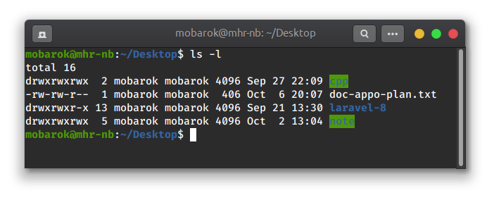

# Linux  Note
## Linux Permission:
লিনাক্স-এ ফাইল ফোল্ডার এর রিড/রাইট পারমিশন।

প্রথমে কিছু সংকেত এর মিনিং জেনে নিইঃ

- u for user
- g for group
- o for other
- r for read
- w for write
- x for execute

u রেপার করে ইউজার কে, g গ্রুপ কে, o অনন্যা 
##  ফাইল ফোল্ডার এর  পারমিশন লগ দেখতেঃ 
ls (list) দ্বারা বর্তমান ডিরেক্টরিতে কি কি ফাইল ফোল্ডার আছে তা দেখা যায়। ls  এর সাথে একটা ফ্ল্যাগ অ্যাড করে পারমিশন লগ সহকারে ফাইল ফোল্ডার এর লিস্ট দেখা যায়।

ফ্ল্যাগ অ্যাড করার জন্য ls এর পরে স্পেস দিয়ে একটা (-) হাইফেন দিতে হয়, তারপর ফ্ল্যাগ এর নাম। এক্ষেত্রে ফ্ল্যাগ হচ্ছে l, l রেপার করে log কে। 
~~~ bash
ls -l
~~~ 

এই ব্যাস আউটপুট টা দেখুন:

এখানে প্রথম লাইনের শুরুতে d এর মানে হচ্ছে note একটি  (directroy) ডিরেক্টরি।  
দ্বিতীয় লাইনের শুরুতে - (হাইফেন) এর মানে হচ্ছে note.txt  একটি (file) ফাইল।  
d directory অথবা  -  (হাইফেন) file এর পরে  প্রথম তিনটি --- অথবা rwx হচ্ছে ইউজার(user) পারমিশন এর জন্য।  
এবং দ্বিতীয় তিনটি --- অথবা rwx হচ্ছে গ্রুপ(group) পারমিশন এর জন্য।  
আর তৃতীয় তিনটি --- অথবা rwx হচ্ছে অনন্যা(other/outside world)  পারমিশন এর জন্য।

### Permission Change করতেঃ 
//to change permission for user/group/other: 
~~~
chmod u+rwx
~~~
~~~
use "chmod  u+r"
or "chmod u-rwx"
~~~
what is 777 or 765???
its mean
here:
7,6,5 represent the individual permission for( in this order) 
user, group, other

4- read
2- write
1- execute
0- no permission

7- means read, write, execute all permission
6- read and write
5- read and execute

use it: chmod 777 filename

